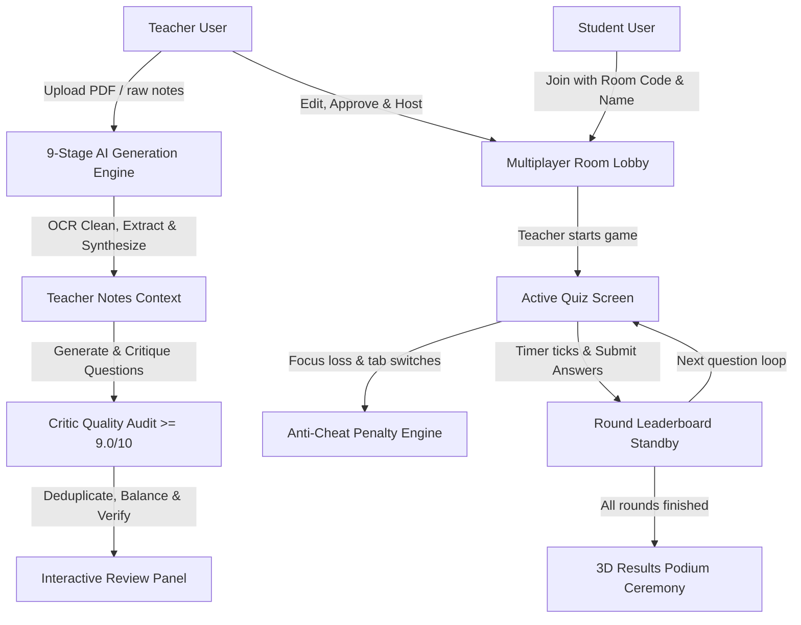
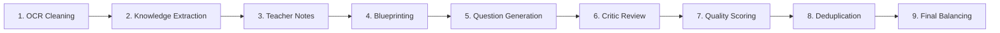

# ⚡️ InTeLLiQuiz: Enterprise AI-Powered Multiplayer Quiz Generation Platform

InTeLLiQuiz is a state-of-the-art educational assessment and multiplayer gaming platform. It transforms raw academic materials (PDFs, DOCX, PPTX, TXT) into university-grade examination questions. The platform features neobrutalist aesthetics, real-time WebSockets synchronization, and an advanced AI generation engine.

---

## 📈 End-to-End System Architecture



### 1. The 9-Stage AI Quiz Generation Pipeline


---

## 🔄 Deep-Dive: The 9-Stage AI Quiz Generation Engine

Directly converting OCR text to quiz questions often results in poor-quality questions containing grammar errors, repetitive structures, or references to document formatting (e.g., "According to page 5..."). InTeLLiQuiz resolves this by processing content through a 9-stage pipeline using Gemini 2.5:

### Step 1: OCR Cleaning & Denoising
- **Function**: Raw text parsed from file buffers (via `pdf-parse`, `mammoth`, or `adm-zip`) is cleaned of headers, footers, page numbers, watermarks, duplicate segments, and encoding errors.
- **Outcome**: A clean, contiguous stream of core academic prose.

### Step 2: Knowledge Extraction
- **Function**: The AI parses the cleaned text to extract primary topics, key concepts, formulas (in LaTeX format), rules, definitions, algorithms, and typical student misconceptions.
- **Outcome**: A structured JSON graph of concepts used for targeted blueprinting.

### Step 3: Teacher Notes Synthesis
- **Function**: Extracted concepts are rewritten as conversational "teacher notes".
- **Rule**: Strips all document references (e.g., "according to the text", "as seen on page X") and copies of sentences, writing original scenarios instead.

### Step 4: Blueprint Design
- **Function**: Establishes target cognitive loads, difficulty ratings, and question counts for each concept based on user configurations.
- **Outcome**: A structural roadmap indicating the required number of easy/medium/hard questions per topic.

### Step 5: Question Generation
- **Function**: Generates questions based on the synthesized notes, using three formats:
  - **70% Multiple Choice (MCQ)**: Scenario-based, application-oriented items.
  - **20% Numerical Calculations**: Requires calculation to arrive at a numeric answer choice.
  - **10% Assertion/Reason or Case Studies**: Evaluates logical relationships between statements.

### Step 6: Critic Question Audit
- **Function**: A separate Critic Agent audits the candidate questions.
- **Rejection Rules**: Questions are rejected if they mention layout details ("document", "page"), use rote definition stems ("What is...", "Which of the following defines..."), or have implausible distractors.

### Step 7: Scorecard Grading
- **Function**: The Critic grades each question from `0.0` to `10.0` across 8 dimensions: *Grammar, Difficulty, Exam Quality, Reasoning, Concept Coverage, Distractors, Natural Language, and Overall Quality*.
- **Gate**: Questions with an overall score below **9.0/10** are sent to a rewrite loop or pruned.

### Step 8: Deduplication
- **Function**: Normalizes the text of all approved questions and performs semantic deduplication to ensure no repetitive questions remain in the pool.

### Step 9: Final Difficulty Balancing
- **Function**: Sorts questions by topic and difficulty, balancing the pool to match the target ratio (**30% Easy, 50% Medium, 20% Hard**) and question count.

---

## 🔌 Socket.io Multiplayer Game Engine

InTeLLiQuiz uses Socket.io to synchronize gameplay state across host consoles and student screens:

1. **Adapter Replication Layer**:
   - The platform attempts to initialize a Redis Pub/Sub adapter to sync socket events across multiple server threads.
   - If Redis is unavailable, it falls back to a thread-safe in-memory session cache.
2. **Dynamic Game Loop State Machine**:
   - **`waiting`**: Host sets up the room, generating a unique code and a dynamic, scannable QR Code. Students check in.
   - **`countdown`**: A synchronized 3-second lobby countdown starts when the host clicks "Start".
   - **`question`**: Broadcasts the active question text, options, and timer limit to all clients.
   - **`timeout`**: Triggered when the timer runs out or all answers are locked. Shows the correct answer, an explanation, and the round standings.
   - **`finished`**: Displays the final leaderboard and personalized performance insights.

---

## 🛡️ Anti-Cheat Penalty Engine

To prevent tab-switching and searching for answers, the platform features a client-side window focus tracker:

1. **Detection**: If a student navigates away from the quiz tab, the browser triggers a blur event.
2. **Warning & Penalty**: A full-screen overlay blocks the quiz interface. The student is warned, and a penalty event is sent to the server:
   - **1st Violation**: Points are deducted (e.g., `-50 pts`).
   - **2nd Violation**: Host is alerted, and the screen blurs for 3 seconds.
   - **3rd Violation**: The student is locked out of the round.
3. **Telemetry**: Anti-cheat events are sent to the host console in real time to help teachers monitor room integrity.

---

## 🎨 Theme & UI Styling System

The application is styled with a neobrutalist design:

- **Theme Toggles**: All main pages (Landing, Dashboard, Quiz Creator, AI Review, Live Room, Results) support light and dark modes.
- **Light Theme (Default)**: Uses a warm cream-to-orange pastel gradient background (`linear-gradient(135deg, #FFFDE8 0%, #FFF5CC 50%, #FFE899 100%)`), thick borders (`border-2 border-black`), and retro neobrutal shadows (`shadow-[6px_6px_0px_#1d1c1c]`).
- **Dark Theme**: Uses a charcoal background (`bg-[#0a0a0f] text-slate-100`) with glow backdrops and clean borders.

---

## 🔌 API Route Reference

### Base URL: `http://localhost:5000/api`

| Method | Endpoint | Description | Auth Required |
|--------|----------|-------------|---------------|
| **POST** | `/auth/register` | Register a new user | No |
| **POST** | `/auth/login` | Login user and retrieve JWT | No |
| **GET** | `/auth/profile` | Retrieve profile of authenticated user | Yes |
| **POST** | `/ai/generate` | Run the 9-stage generation pipeline on uploaded file or text | Yes |
| **POST** | `/ai/regenerate` | Regenerate a single question card based on a topic | Yes |
| **POST** | `/ai/rewrite` | Request a Critic AI rewrite for a specific question | Yes |
| **GET** | `/quizzes` | Fetch all quizzes generated by the teacher | Yes |
| **POST** | `/quizzes` | Approve and export reviewed cards as a permanent quiz | Yes |
| **PUT** | `/quizzes/:id` | Update an existing quiz in the database | Yes |
| **DELETE**| `/quizzes/:id` | Delete a quiz from the syllabus database | Yes |

---

## ⚙️ Local Development Setup

### System Prerequisites
- **Node.js**: v18.0.0 or higher
- **MongoDB**: Local MongoDB instance running on port `27017`
- **Redis** *(Optional)*: Local Redis instance running on port `6379` for Pub/Sub testing

### 1. Configure the Backend
Navigate to the `backend/` directory, create a `.env` file, and install packages:
```bash
cd backend
npm install
```

Configure your `.env` variables:
```env
PORT=5000
MONGODB_URI=mongodb://127.0.0.1:27017/quizai
JWT_SECRET=your_jwt_secret_token_key_here
GEMINI_API_KEY=your_google_gemini_api_key_here
```

Start the API server:
```bash
npm run dev
```

### 2. Configure the Frontend
Navigate to the `frontend/` directory and launch the client server:
```bash
cd ../frontend
npm install
npm run dev
```

The application will be accessible at: **http://localhost:5173**

---

## ⚡️ Troubleshooting & Resiliency

- **Gemini API Outages (HTTP 503/429)**: The server automatically retries requests up to 3 times using exponential backoff (e.g., 2s → 4s → 8s) to mitigate rate limits or network issues.
- **Broken PDF Extraction**: If document parsing fails, verify that `pdf-parse` is installed. The backend uses `const pdf = require('pdf-parse')` to handle PDF text extraction.
- **Redis Connection Errors**: If Redis is not running locally, the server logs a warning and falls back to a thread-safe in-memory session cache, ensuring the application remains functional.
