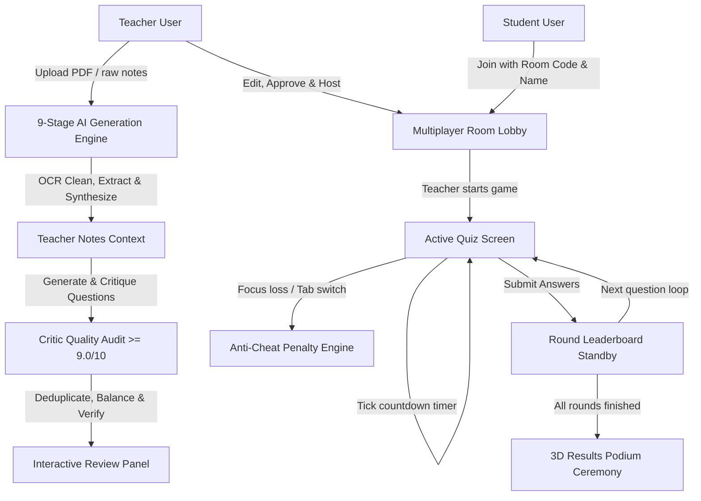
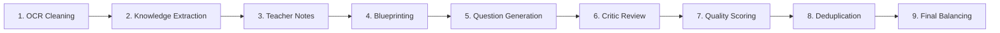

# QuizAI: Enterprise AI-Powered Real-Time Quiz Platform

QuizAI is a high-fidelity, real-time multiplayer quiz platform built for classrooms and competitive exam training (GATE, CAT, GRE, Placement Tests). It enables teachers to instantly generate concept-based, exam-quality quizzes from textbook PDFs, slides, or raw notes using a multi-agent, 9-stage Gemini AI pipeline. Quizzes can be managed interactively, hosted live with synchronized socket clocks, anti-cheat detection, and 3D results podiums.

---

## 📊 Platform Architecture Diagrams

### 1. End-to-End Application Flow


### 2. The 9-Stage AI Quiz Generation Pipeline


---

## 🔄 Full User Experience Flow

### Phase A: Ingestion & 9-Stage AI Generation
1. **OCR Cleaning & Denoising (Step 1)**: Strips out watermarks, page numbers, formatting headers/footers, duplicate paragraphs, and garbage symbols.
2. **Knowledge Extraction (Step 2)**: Extracts topics, definitions, concepts, LaTeX formulas, rules, exceptions, algorithms, and typical student mistakes into a structured JSON graph.
3. **Teacher Notes Synthesis (Step 3)**: Translates raw content into simple, natural teacher notes written in conversational prose. This removes any document-based wording (like "according to page X" or "as seen in the PDF").
4. **Blueprint Design (Step 4)**: Establishes target cognitive loads, Bloom levels, and difficulty distributions for each topic.
5. **Exam Question Generation (Step 5)**: Synthesizes scenario-based questions from the Teacher Notes, adhering to university-grade standards (GATE/CAT style).
6. **Critic Audit & Scoring (Steps 6–7)**: Evaluates candidates across 9 scorecard dimensions (Grammar, Difficulty, Exam Quality, Reasoning, Concept Coverage, Distractors, Natural Language, Overall Quality). Questions scoring below **9.0/10** are automatically rewritten or pruned.
7. **Deduplication & Balancing (Steps 8–9)**: Deduplicates semantic duplicates in-memory and balances difficulty levels to fit the target ratio: **30% Easy, 50% Medium, 20% Hard**.

### Phase B: Interactive Review & AI Rewrite
1. **Metadata Grid**: Teachers inspect the generated quiz on the *AI Review Panel*. Each card displays:
   - **Quality Score** (e.g. `9.4/10` average critic grade)
   - **Bloom Level** (e.g. `Apply`, `Analyze`, `Evaluate`)
   - **Concept & Topic Mapping**
   - **Confidence Score** (%)
   - **Estimated Solving Time** (seconds)
   - **Question Type & Difficulty**
2. **Action Telemetry**:
   - **AI Rewrite**: Submits a single card to `/api/ai/rewrite` where a dedicated editor agent rewrites the prompt, improving distractor plausibility and stem clarity.
   - **Regenerate**: Swaps the question card for a fresh replacement card matching the same topic.
   - **Approve/Reject**: Individual item inclusion toggles.

### Phase C: Live Competitive Gameplay
1. **Synchronized Multiplayer Lobby**: Teachers launch rooms generating 6-digit access codes. Students join using their devices. Lobby monitors connected players and supports mock contestant simulations for testing.
2. **Active Rounds**: Countdown timers tick concurrently. Submissions award speed bonuses.
3. **Anti-Cheat Penalty Engine**: Client focus blurs (tab-switching) apply point penalties (e.g., `-50 points`), issue warnings, and alert the host console in real time.
4. **Leaderboards & Podium**: Displays standing slides and explanations after each round, ending with a 3D winners' trophy stand.

---

## ⚙️ Question Formatting & Style Rules

### Standard Distributions
- **Type Distribution**: **70% Multiple Choice (MCQ), 20% Numerical Calculations, and 10% Assertion/Reason or Case Studies**.
- **Difficulty Distribution**: **30% Easy, 50% Medium, and 20% Hard**.
- **Topic Coverage**: Every extracted concept is validated to have at least one representing question.

### Prohibited Patterns
- Basic definition questions (*"What is...", "Define..."*) are banned.
- Document citations (*"According to...", "Based on page..."*) are prohibited.
- Stems start with context: *"A company stores records...", "A process arrives...", "A train crosses a bridge..."*

---

## 🔌 API Route Reference

### Base URL: `http://localhost:5000/api`

| Method | Endpoint | Description | Auth Required |
|--------|----------|-------------|---------------|
| POST | `/auth/register` | Register new user | No |
| POST | `/auth/login` | Login user | No |
| POST | `/ai/generate` | Run the 9-stage generation pipeline on uploaded file or text | Yes (Teacher/Admin) |
| POST | `/ai/regenerate` | Regenerate a single card based on a deleted topic | Yes (Teacher/Admin) |
| POST | `/ai/rewrite` | Request Critic AI rewrite for a specific question card | Yes (Teacher/Admin) |
| POST | `/quizzes` | Approve and export reviewed cards as a permanent quiz | Yes (Teacher/Admin) |

---

## 🔌 Socket.io Events Reference

| Event Name | Sender | Receiver | Description |
|------------|--------|----------|-------------|
| `createRoom` | Host | Server | Initializes memory room session collection. |
| `joinRoom` | Student | Server | Registers student profile in active lobby. |
| `startQuiz` | Host | Server | Starts synchronous game loop countdowns. |
| `questionStarted` | Server | All | Delivers active question, options, and timer limit. |
| `submitAnswer` | Student | Server | Processes answer, speed bonuses, and score records. |
| `timerUpdated` | Server | All | Delivers ticking seconds and game pause flags. |
| `leaderboardUpdated` | Server | All | Delivers correct choice explanation and round standings. |
| `teacher_cheat_alert`| Server | Host | Broadcasts anti-cheat violation to host dashboard. |
| `quizEnded` | Server | All | Declares podium ceremony standings and stats. |

---

## ⚙️ Quick Start

### 1. Configure the Backend
Navigate to the `backend/` directory, create a `.env` file, and install packages:
```bash
cd backend
npm install
```

Configure your `.env` variables:
```env
PORT=5000
MONGODB_URI=mongodb://127.0.0.1:27017/quizai
JWT_SECRET=your_jwt_secret_token
GEMINI_API_KEY=your_gemini_api_key
GEMINI_MODEL=gemini-2.5-flash
```

Start the API server:
```bash
npm run dev
```

### 2. Configure the Frontend
Navigate to the `frontend/` directory and launch the client server:
```bash
cd ../frontend
npm install
npm run dev
```

The application will be accessible at: **http://localhost:5173** (or the port allocated by Vite).
